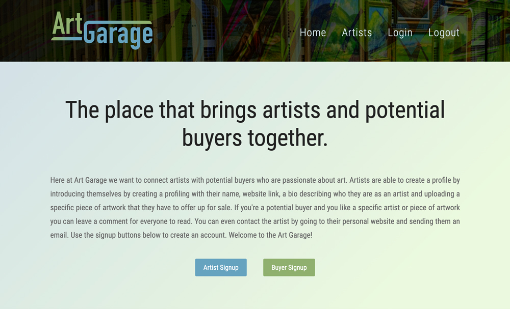

# ArtGarage

## The place that brings artists and potential buyers together.

 

## Purpose:

Here at Art Garage we want to connect artists with potential buyers who are passionate about art. Artists are able to create a profile by introducing themselves by creating a profiling with their name, website link, a bio describing who they are as an artist and uploading a specific piece of artwork that they have to offer up for sale. If you're a potential buyer and you like a specific artist can leave a comment for everyone to read. You can even contact the artist by going to their personal website and sending them an email. Use the signup buttons below to create an account. Welcome to the Art Garage!

 

## Heroku App Link:

## https://art-garage-app.herokuapp.com/

 

## **Table of contents:**

- [Installation](#installation)
- [Start](#start)
- [Usage](#usage)
- [Contribute](#contribute)

 

     

 

 

## This Full-stack App Was Created Using:

- HTML
- CSS
- JavaScript
- Star-rating.js
- NodeJS
- MySQL/MySQL2
- Sequelize
- Express
- Express-handlebars
- Express-session
- Connect-session-sequelize
- Bcrypt
- Insomnia
- Dotenv package
- Heroku
- Fs-extra
- Body-parser
- GitHub

 

## Installation:

### _To install all packages use this command in the the terminal:_

### npm i

 

## Start:

### _To start use this command in the the terminal => then use http://localhost:3001/ in the browser:_

### npm start

 

## Usage:

### The respository can be cloned and placed in a folder remotely.

 

## Contribute:

### Please contact us regarding contributing to this repository. All additions must be approved.

 

## Contributing Programmers:

Bethany Jennings, Eric VanKirk, Guadalupe Rocha, Ron Dronet
